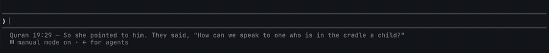

# claude-quran-verses



Show a complete-sentence Quran verse in your coding-agent status line while you work.

**Primary:** [Claude Code](https://code.claude.com)  
**Also:** Cursor CLI  
**Best-effort:** OpenAI Codex TUI (if your build supports a custom status line)

Same *idea* as [pi-quran-verses](https://github.com/mwijanarko1/pi-quran-verses) (a verse while the agent is busy), adapted to each tool’s real UI: a **status line**, not Pi’s working spinner.

Only **complete-sentence** verses are used. Incomplete phrases, mid-sentence connectors, letter names (muqattaʿāt), and unfinished translation fragments are filtered out.

Example status line text:

```text
Quran 1:2 — [All] praise is [due] to Allāh, Lord of the worlds.
```

A new verse is chosen about every 10 seconds. Claude Code polls on a timer; Cursor CLI debounces updates to the same interval. The verse picker itself also holds each verse for 10s (`QURAN_VERSE_ROTATE_MS`) so hosts that fire more often do not thrash.

## Requirements

- Node.js 18+
- Claude Code, Cursor CLI, and/or Codex installed locally

## Install

### From npm (recommended)

```bash
npx claude-quran-verses
```

Or install the CLI globally:

```bash
npm install -g claude-quran-verses
claude-quran-verses
```

### From git

```bash
git clone https://github.com/mwijanarko1/claude-quran-verses.git
cd claude-quran-verses
node bin/install.mjs
```

Then **restart** Claude Code / Cursor Agent / Codex so the status line reloads.

### What the installer changes

| Agent | Config written |
|---|---|
| Claude Code | `~/.claude/settings.json` → `statusLine` (`refreshInterval: 10`) |
| Cursor CLI | `~/.cursor/cli-config.json` → `statusLine` (`updateIntervalMs: 10000`, `refreshInterval: 10`) |
| Codex | `~/.codex/config.toml` → `[tui].status_line` if not already set |

Existing settings keys are preserved; only `statusLine` / Codex `status_line` is added or updated.

## Usage

After install, verses appear in the status line automatically when the agent UI refreshes.

### Choose a translation

```bash
quran-verse --list
quran-verse --set-edition en.saheeh
quran-verse --set-edition en.haleem
```

If you did not install globally:

```bash
npx quran-verse --list
# or from a clone:
node bin/quran-verse.mjs --list
```

Settings are stored at:

```text
~/.claude-quran-verses.json
```

Example:

```json
{
  "editionId": "en.saheeh"
}
```

### Test without an agent

```bash
quran-verse
echo '{}' | node "$(npm root -g)/claude-quran-verses/bin/statusline.mjs"
```

From a local clone:

```bash
node bin/quran-verse.mjs
echo '{}' | node bin/statusline.mjs
```

## Languages and translations

| Language | Edition ID | Translator |
|---|---|---|
| Arabic | `ar.uthmani` | Uthmani |
| English | `en.saheeh` | Saheeh International (default) |
| English | `en.haleem` | MAS Abdel Haleem |
| English | `en.bridges` | Bridges Translation |
| Spanish | `es.isa-garcia` | Sheikh Isa Garcia |
| German | `de.bubenheim` | Bubenheim & Elyas |
| French | `fr.rashid-maash` | Rashid Maash |
| Urdu | `ur.tafheem-maududi` | Tafheem e Qur'an - Maududi |
| Urdu | `ur.maududi-roman` | Abul Ala Maududi (Roman Urdu) |
| Urdu | `ur.tafsir-usmani` | Tafsir E Usmani |
| Urdu | `ur.bayan-ul-quran` | Bayan-ul-Quran |
| Indonesian | `id.indonesian` | Indonesian Islamic Affairs Ministry |

## How it works

1. Bundled verse pools live in `data/editions.json` (curated complete-sentence refs).
2. `bin/statusline.mjs` is registered as the agent status-line command.
3. Hosts re-run the status-line command on a ~10s cadence:
   - Claude Code: `refreshInterval: 10`
   - Cursor CLI: `updateIntervalMs: 10000` (plus `refreshInterval: 10` for Claude-compatible configs)
4. `bin/quran-verse.mjs` keeps the same verse for 10s (override with `QURAN_VERSE_ROTATE_MS`) so rapid re-invocations do not spin verses.
5. No network calls at runtime.

For Claude Code and Cursor CLI this is **UI-only**: verses are not injected into the model context.

## Uninstall / disable

Remove the `statusLine` field from:

- `~/.claude/settings.json`
- `~/.cursor/cli-config.json`

And, if present, remove the Codex block:

```toml
[tui]
status_line = [...]
status_line_timeout_ms = 800
```

Optional settings files you can delete:

```text
~/.claude-quran-verses.json
~/.claude-quran-verses.last
```

## Notes

- Codex support is best-effort and depends on whether your Codex build honors `[tui].status_line`.
- Devin and Grok Build currently have no status-line/spinner API, so they are not wired.
- Related package for the Pi coding agent: [pi-quran-verses](https://www.npmjs.com/package/pi-quran-verses).

## Package layout

```text
claude-quran-verses/
├── bin/
│   ├── install.mjs      # wire Claude + Cursor (+ Codex probe)
│   ├── statusline.mjs   # status-line entry (stdin JSON → verse)
│   └── quran-verse.mjs  # pick / list / set edition
├── data/
│   └── editions.json    # bundled verse pools
├── package.json
├── LICENSE
└── README.md
```

## License

MIT
